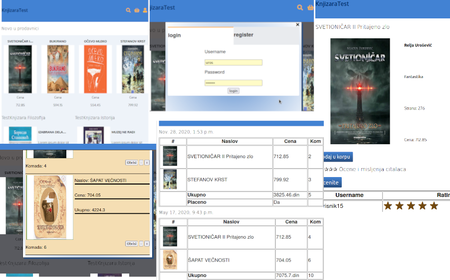

# Django Books

Example of how can one library work with Django Framework

## Screenshots




## Installation

```
pip3 install -r requirements.txt

```
## Starting project

```
python3 manage.py runserver 127.0.0.1:8000
```
