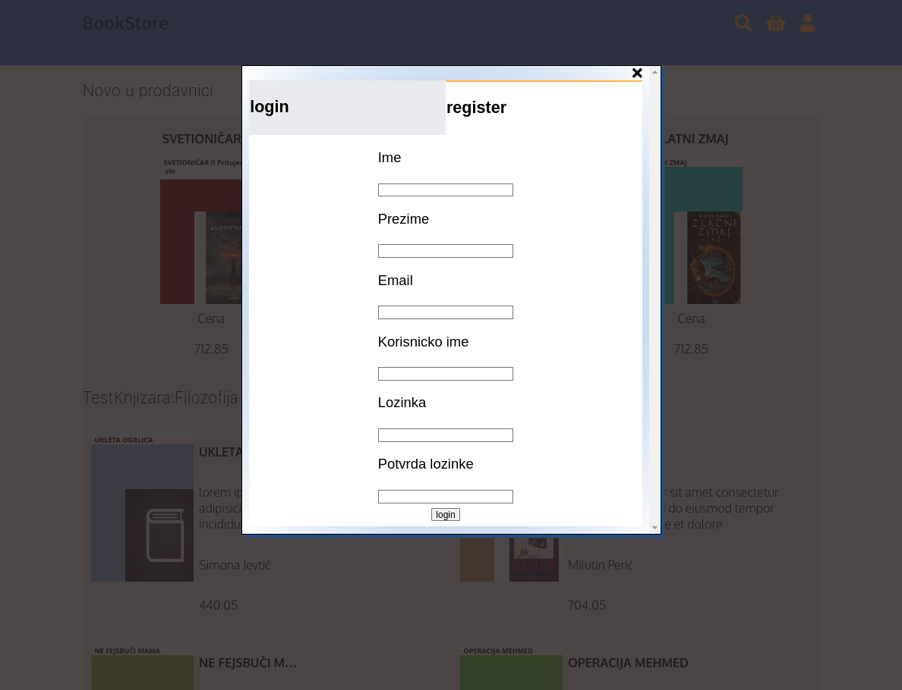
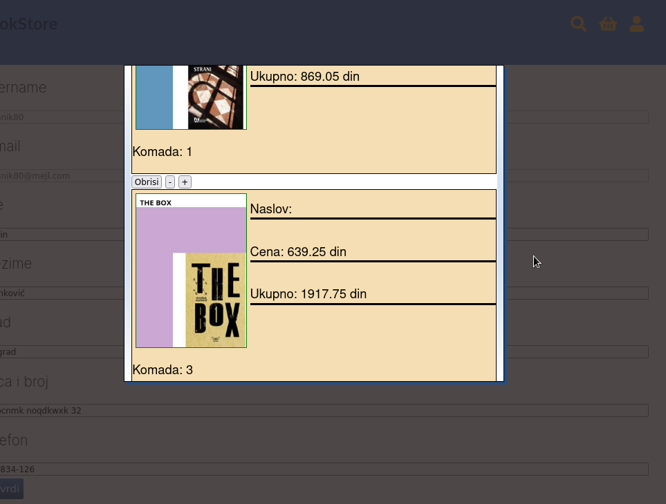
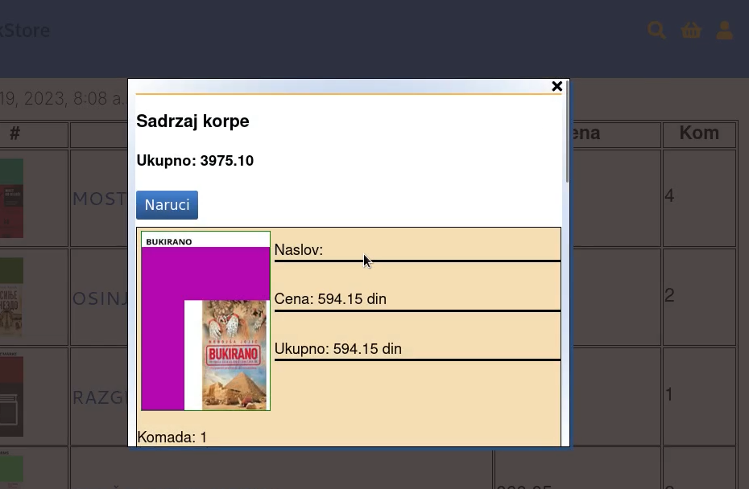
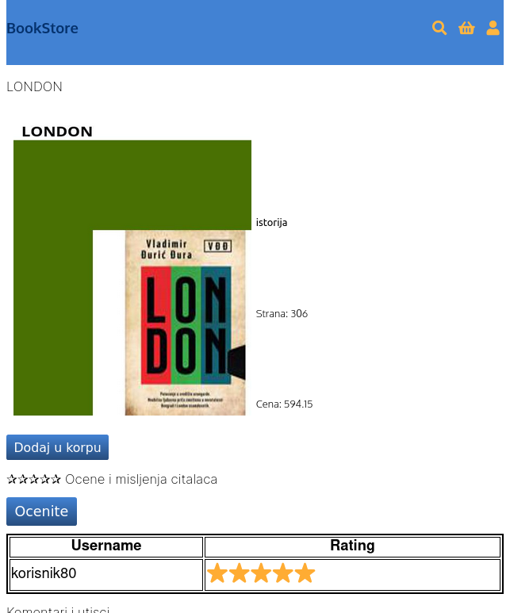
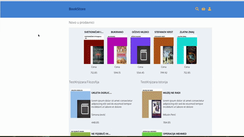

# Simple Book Store

I made this web app in the last year at the college :school:.

It didn't had fancy JavaScript framework, just pure Django + little bit of jQuery :older_man:.

There is hype going around with HTMX library. So I decided to give it a try :cool:.

## Tech Stack

Backend: Python + Django + HTMX :snake:

Database: SQLite :department_store:

Frontend: Alpine.js :snowboarder: 

## Run the application

### Clone the repo

```console
git clone https://github.com/uros-5/django-books
cd django-books
```

### Setup virtual environment for python.

```console
python3 -m venv venv
source venv/bin/activate
```

### Install dependencies

```console
pip3 install -r requirements.txt
```

### Make migrations for database

```console
python3 manage.py makemigrations
python3 manage.py migrate
```

### Fill database with data(users, authors, books, orders)

Populating database will be executed in 'django shell'.

```console
python3 manage.py shell
```
In shell paste this

```python
from bookstore import db_work
```
It will fetch images and do all database related work.

### Build frontend

```console
cd bookstore/ui
npm install
npm run build
cd ../..
```

### Run server

```console
sh runserver.sh
```

### Screenshots











